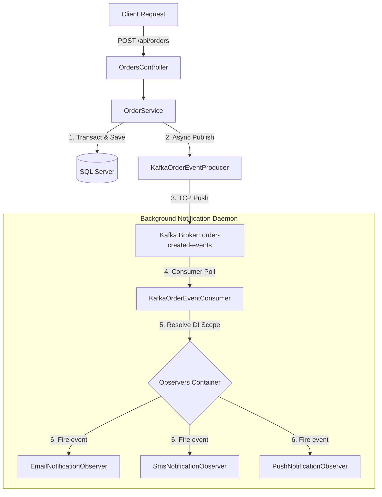

# Order Management System

An ASP.NET Core Web API representing an Order Management System. It features high-performance caching (via Redis), logging (via Serilog), and a decoupled, event-driven notification framework utilizing the **Observer Design Pattern** backed by **Apache Kafka**.

---

## Architecture Overview

The system utilizes an asynchronous event publishing flow to fully decouple business transaction completions from side-effects (e.g., dispatching emails, SMS, push notifications).



### Core Technologies
*   **Target Framework**: `.NET 8.0`
*   **Database ORM**: Entity Framework Core with SQL Server
*   **Distributed Cache**: Redis Cache (StackExchange.Redis)
*   **Message Broker**: Apache Kafka (`Confluent.Kafka`)
*   **Logging Engine**: Serilog (Sinks for Console, File, SQL Server, and Elasticsearch)
*   **Testing Framework**: xUnit, Moq, and EF Core In-Memory

---

## Project Structure

*   **`OrderManagementSystem.API`**: Main web application containing controllers, services, database contexts, and the Kafka observers/producers.
*   **`OrderManagementSystem.Auth`**: Authentication helpers/models.
*   **`OrderManagementSystem.Tests`**: Unit and integration tests (using xUnit & Moq).
*   **`docker-compose.yml`**: Docker orchestration for local infrastructure (Zookeeper, Kafka).

---

## Prerequisites

Ensure you have the following installed on your machine:
*   [.NET 8.0 SDK](https://dotnet.microsoft.com/download/dotnet/8.0)
*   [Docker Desktop](https://www.docker.com/products/docker-desktop/) (For running Zookeeper, Kafka, Redis, and SQL Server locally)

---

## Getting Started

### 1. Spin up Local Infrastructure
Use the provided Docker Compose configuration to start Zookeeper and Kafka:
```bash
docker compose up -d
```

### 2. Configure Database Connections
Update `appsettings.json` in the API project with your target SQL Server connection string under `ConnectionStrings:OrderSystemConnectionString` and Redis connection string under `ConnectionStrings:Redis` if different from the defaults.

### 3. Run EF Core Migrations
To initialize the SQL Server database schema, run the following EF Core migration commands from the repository root:
```bash
dotnet ef database update --project OrderManagementSystem.API
```

### 4. Run the API Project
Start the ASP.NET Core API server:
```bash
dotnet run --project OrderManagementSystem.API
```
The server defaults to running on: `http://localhost:5193`

---

## How to Test

### Manual Integration Verification
An HTTP scratchpad file is provided at [OrderManagementSystem.API.http](file:///Users/vimalkumarsingh/Desktop/OrderManagementSystem/OrderManagementSystem.API/OrderManagementSystem.API.http). You can execute these requests directly inside your IDE (using the REST Client extensions) to:
1. Query orders (`GET /api/orders/1`).
2. Place a new order (`POST /api/orders`). Placing an order will automatically trigger the Kafka producer to publish an event, and the hosted background consumer will dispatch notifications to the Email, SMS, and Push observers.
3. List customer orders (`GET /api/orders/customer/1`).

### Running Automated Tests
Run the entire unit test suite containing coverage for core service validations, caching assertions, and Kafka observer fault-isolation:
```bash
dotnet test
```
